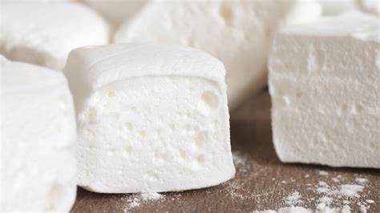
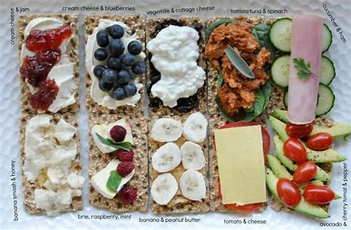

## Episode 15
  - Gin

  - Yahtzee

  - Pocker

  - running our game nights, instead of playing in it.

  - take to 
    + begin or fall into a habit of doing something.

  - Finally we all agree Marshall should be running our game nights, instead of playing in it, which he took to mean, 'invent your own game'.
    + In this sentense, run game nights means to be the host of game nights. It is not running away from their game nights, and it does mean Marshall should be running while others are playing the game. And Marshall thought being a host of a game meant inventing his own game.

  - games:
    + Candy Land
    + I Never
    + Pictionary
    + Backgammon

  - have the hots for 
    + be sexually attracted to

  - Leg Warehouse

  - have half a mind to
    + To have inclination or intention to do something, especially as a result of some unpleasant experience

  - swear someone to secrecy
    + to make someone promise to keep a secret

  - interrogate
    + to ask someone a lot of questions for a long time in order to get information, sometimes using threats and violence
    + to get information from a computer

  - free spirited
    + independent and not constrained by convention

  - autobiography
    + an account of a person's life written by that person

  - crappy
    + of extreme poor quality

  - come clean
    + To admit something to someone, often regarding a wrongdoing that one has tried to hide.

  - Gumdrop 
    + a firm, translucent sweet made with gelatin or gum arabic

  - prude
    + a person who is or claims to be easily shocked by matters relating sex and nudity

  - you are a peach
    + you are wonderful/helpful

  - tempest
    + a violent windy storm

  - woe
    + great sorrow or distress

  - lusty leopard
    + a strip club

  - off the grid
    + not connected to municipal utility systems

  - what was up with the tape

  - recess
    + in school, a period of time between classes when children do not study

  - I am meant for you
    + I was born to be yours.

  - Nonfat latte to go

  - Mellow order
    + composure: the state or feeling of being calm and in control of oneself
    + American slang. It means a person's composure or chill factor and keeping that feeling continuously.
 
  - touchy-feely
    + openly expressing affection or other emotions
    + touchy-feely guys calling home to talk baby talk to their kids

  - peace out
    + often used instead of bye, goodbye. It is much less formal

  - way to step up

  - marshmellow

    

  - topping
    + a layer of food poured or spread over a base of a different type of food to add flavour.
    
    

  - deem your offering worthy
  	+ deem: regard or consider in a specific way

  - saga
  	+ a long involved story, account, or series of incidents

  - heated argument

  - afghan
  	+ a woollen blanket or shawl, typically one knitted or crocheted in strips or squares.
 
  - judge not, lest ye be judged
  	+ Dont't judge me. Only God can judge what I do, and no one else.

  - paycheck
  	+ a salary or wages cheque made out to an employee

  - man up
  	+ to make an effort to deal with something in a way that is considered strong or manly.

  - ralph
  	+ vomit

  - doormat
  	+ a mat placed in a doorway, on which people can wipe their shoes on entering the building.
 
  - kicker

  - string
  	+ a series of related things or events
  	+ a string of one-night stands

  - coop up
  	+ to keep inside a building or in a small space

  - poopy
  	+ a stupid or ineffectual person

  - dodge
  	+ avoid (someone or something) by a sudden quick movement