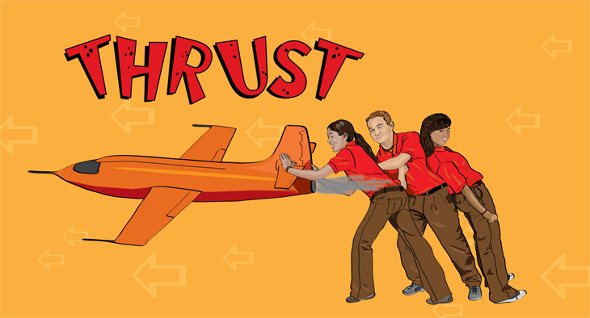
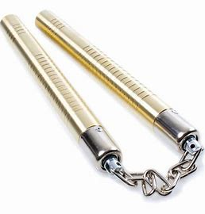

## Episode 20
  - game-changing emergency
  	+ an event, idea or procedure that affects a significant shift in the current way of doing or thinking about something

  - Van Smoot
  	+ Van Smoot house is a mansion house near Hudson River.
    

  - mansion
  	+ a large, impressive house

  - a deposit check
  	+ deposit: a deposit is a transaction involving transfer of money to another party for safekeeping. However, a deposit can refer to a portion of money used as security or collateral for the delivery of good.
  		* security: [guess] refers to a portion of money
  		* collateral
  			- something pledged as security for repayment of a loan, to be forfeited in the event of default
  				+ pledge: commit by a solemn promise
  					* solemn: formal and dignified; serious
  				+ forfeit: lose or be deprived of as a penalty for wrongdoing.

  - Azerbaijan
  	+ A country in estern Europe. It is bounded on the north by Russia.

  - florist
  	+ a person who sells and arranges plants and cut flowers.

  - exaggerate
  	+ represent (something) as being larger, better or worse than it really is.

  - All tuckered out
  	+ tucker: exhaust, wear out

  - on three count of
  	+ count is the number of charges.

  - Led Zeppelin
  	+ name of a band

  - audition
  	+ an interview for a paticular role or job as a singer, actor, dancer, or musician, consisting of a practical demonstration of the candidate's suitability or skills

  - wiggle
  	+ v. move or to cause move up and down or from side to side with small rapid movements
  	+ n. a wiggling movement

  - a wee bit intense
  	+ a little bit intense

  - poke out
  	+ extend, push, or thrust something out
  	  * thrust: to push or drive with force; to cause to enter or pierce by or as if by pushing; stab, pierce
  	  
  	  * even if a dinosaur should poke his head out of my butt.

  - roll with it
  	+ to adapt to a suitation despite unexpected  circumstances or chanllenges.

  - caterer
  	+ a person or company who provide food and drink at a social event or other gathering.

  - sneak
  	+ move or go in a furtive or stealthy manner

  - crash
  	+ move or cause to move with force, speed, and sudden loud noise

  - field hockey 
  	+ also called hockey, outdoor game played by two opposing teams of 11 players each.

  - blend
  	+ mix (one substance) with another substance so they combine together

  - statute
  	+ a written law passed by a legislative body
  		* legislative: having the power to make laws
  	+ statutory:
  		* required, permmited or enacted by statute

  - outlaw
  	+ a person who break the law especially one who remains at large or is a fugitive

  - drive off
  	+ to cause or force one to leave

  - cliff
  	+ a steeo rock face, especially at the edge of the sea

  - sore
  	+ painful or aching

  - stick out
  	+ be extremely noticeable

  - wardrobe
  	+ a large, tall cabinet where clothes are hung or stored

  - corporate plastic 

  - umpire
  	+ a career, an officical who watches a game or match closely to enforce the rules and arbitrate on matters arising from the play.
  		* arbitrate: reach an authoritative judgement or settlement.

  - skank
  	+ a steady-paced dance

  - cough syrup
  	+ a thick sticky sulotion of sugur and water often flavoured or medicated the consentrated juice of a fruit or plant.

  - kind of wasted
  	+ under the influence of alcohol or illgeal drugs
  		*  I am kinda wasted

  - sheet music
  	+ printed music, as opposed to performed music or recorded music

  - buzzing
  	+ a feeling of intense pleasure, excitement, or interest.

  - phlegm
  	+ self-control, calmness of temperament
  		* temperament: a person's or animal's nature, as it permanently affects their behavior.

  - berserker
  	+ an ancient warrior who fought in a wild frenzy
  		* frenzy: a state or period of uncontrolled excitement or wild behavior

  - claw my eyes out
  	+ someone saw something they really didn't want to see like it was disturbing to them

  - swirl
  	+ move in a twisting pattern

  - snuck in the back
  	+ snuck: the participle of sneak

  - janitor
  	+ a person employed as a caretaker of a building

  - adrenaline
  	+ a hormone secreted by adrenal glands 
  		* secrete: (of a cell, gland, or organ) produce and discharge (a substance)

  - to get carried away
  	+ to be so excited about something or someone that one loses control of one's behaviour, speech, or actions.

  - nunchaku
  	+ a japanese martial arts
  	

  - have a second thought

  - soak up
  	+ enjoy pleasure or experiencing in usually a slow and relexed way

  - shackle
  	+ a pair of fetters connected together by a chain, used to fasten a prisoner's wrist or ankles together
  		* fetters: a chain or manacle used to restrain a prisoner, typically placed around the ankles.
  		* fasten: close or do up securely

  - blabber
  	+ talk foolishly, mindlessly, or excessively

  - bohemian
  	+ a socially unconventional person, especially one who involves in the arts.

  - trespass
  	+ to enter the owner's land or property without permission

  - assault
  	+ make a physical attack on
  	+ assault of a minor: make a physical attack on someone who is under 18.

  - mascot
  	+ a person or thing that is supposed to bring a good luck
